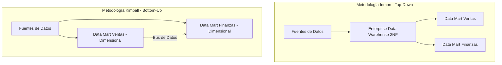

El núcleo de gravedad de cualquier iniciativa de Inteligencia de Negocios (BI) a escala corporativa es el **Almacén de Datos (Data Warehouse)**. Se define como un repositorio centralizado, integrado, orientado a temas, variante en el tiempo y no volátil, diseñado exclusivamente para el análisis retrospectivo y estratégico.

---

### Arquitectura Canónica de Tres Niveles

La infraestructura de un almacén de datos se distribuye conceptualmente en tres capas:

1. **Nivel Inferior (*Bottom Tier*):** Alberga el motor de la base de datos analítica y las herramientas de ingesta de datos.
2. **Nivel Medio (*Middle Tier*):** Aloja los motores analíticos de procesamiento multidimensional, generalmente basados en tecnologías **OLAP** (Online Analytical Processing).
3. **Nivel Superior (*Top Tier*):** Comprende la capa de presentación, APIs de consulta, sandboxes para científicos de datos y herramientas de visualización de autoservicio (como Power BI, Tableau).

#### ODS (*Operational Data Store*) vs. EDW (*Enterprise Data Warehouse*)
* **ODS (Almacén de Datos Operativos):** Repositorio intermedio, volátil y de tiempo casi real, optimizado para la toma de decisiones operativas diarias.
* **EDW (Almacén de Datos Empresarial):** Repositorio definitivo, histórico, no volátil e integrado de toda la corporación.

---

### Incompatibilidad de Paradigmas: OLTP vs. OLAP

La separación física entre bases de datos transaccionales y analíticas se debe a la incompatibilidad de sus cargas de trabajo:

#### Sistemas OLTP (Online Transaction Processing)
* **Propósito:** Sostener la operación cotidiana en tiempo real (ej. ventas, transferencias bancarias).
* **Diseño:** Altamente normalizados (3FN) para garantizar la consistencia **ACID** y evitar redundancias.
* **Concurrencia:** Alta frecuencia de transacciones rápidas de inserción, actualización y borrado de registros individuales.

#### Sistemas OLAP (Online Analytical Processing)
* **Propósito:** Analizar tendencias e identificar patrones en millones de registros históricos.
* **Diseño:** Desnormalizados o estructurados en cubos multidimensionales.
* **Mecánica:** Lecturas masivas e intensivas de agregación de datos (ej. `SUM`, `AVG`, `GROUP BY`) que inhabilitarían un sistema OLTP en producción debido a bloqueos.

| Característica Arquitectónica | Sistemas OLTP (Transaccionales) | Sistemas OLAP (Analíticos) |
| :--- | :--- | :--- |
| **Propósito** | Gestión del negocio en tiempo real. | Toma de decisiones y analítica avanzada. |
| **Concurrencia** | Miles de usuarios concurrentes escribiendo. | Decenas de analistas realizando consultas masivas. |
| **Operaciones Comunes** | `INSERT`, `UPDATE`, `DELETE` rápidos. | Consultas de lectura complejas e históricas. |
| **Esquema de Base de Datos** | Altamente Normalizado (3FN). | Desnormalizado (Estrella, Copo de nieve, Cubos). |
| **Volumen por Consulta** | Kilobytes (registros individuales). | Gigabytes/Terabytes (agregaciones históricas). |

---

### La Evolución de la Ingesta: De ETL a ELT

#### ETL (Extracción, Transformación y Carga)
El enfoque tradicional diseñado para infraestructuras *on-premise* con recursos de cómputo y almacenamiento limitados.
1. **Extracción:** Se obtienen los datos de los sistemas transaccionales.
2. **Transformación:** En un servidor intermedio (Staging), los datos se limpian, normalizan y consolidan.
3. **Carga:** Los datos finales pulidos se inyectan en el Data Warehouse.

#### ELT (Extracción, Carga y Transformación)
La revolución moderna de la ingesta impulsada por almacenes de datos en la nube (*Cloud Data Warehouses*) como Snowflake, Google BigQuery y Amazon Redshift, donde el almacenamiento y el cómputo están desacoplados.
1. **Extracción:** Se extraen los datos crudos.
2. **Carga:** Se cargan los datos directamente en su estado original (estructurado o semiestructurado) al Data Warehouse.
3. **Transformación:** Aprovechando el poder de procesamiento distribuido masivo (MPP) de la nube, los datos se transforman *in-situ* mediante SQL o Apache Spark.

```sql
-- Consulta típica en BigQuery procesando JSON semiestructurado cargado mediante ELT
SELECT 
  cliente_id,
  JSON_VALUE(datos_crudos.metodo_pago) AS metodo_pago,
  SUM(CAST(JSON_VALUE(datos_crudos.monto) AS FLOAT64)) AS total_gastado
FROM `mi_proyecto.ventas.ingesta_directa`
WHERE fecha >= '2026-01-01'
GROUP BY 1, 2;
```

---

### Arquitecturas Organizacionales: Inmon vs. Kimball

El diseño conceptual del Data Warehouse a nivel corporativo se divide en dos escuelas clásicas de pensamiento:



#### 1. Bill Inmon: Enfoque "Top-Down"
* **Propuesta:** Construcción de un Enterprise Data Warehouse (EDW) centralizado y estrictamente normalizado (3FN) que actúa como la "única fuente de verdad".
* **Distribución:** El EDW distribuye subconjuntos de datos a estructuras departamentales más pequeñas llamadas **Data Marts**.
* **Pros/Contras:** Excelente integridad de datos y nula redundancia, pero requiere un alto costo inicial y extensos ciclos de diseño.

#### 2. Ralph Kimball: Enfoque "Bottom-Up"
* **Propuesta:** El almacén de datos es la suma lógica y federada de múltiples **Data Marts dimensionales**.
* **Arquitectura de Bus:** Se evita el caos y los silos de datos compartiendo de forma obligatoria las mismas dimensiones básicas (ej. Clientes, Productos, Calendario) llamadas **Dimensiones Conformadas** (*Conformed Dimensions*).
* **Pros/Contras:** Implementación ágil y rápida entrega de valor al negocio, aunque requiere mayor disciplina organizativa para mantener las dimensiones alineadas.

---

## Ideas clave

<Callout type="info">
**OLTP vs. OLAP:**
OLTP optimiza transacciones cortas, concurrentes y seguras. OLAP prioriza la velocidad de lectura y consolidación analítica retrospectiva.
</Callout>

<ExerciseBlock title="Evaluación de Arquitecturas">
Analiza el caso de una startup de comercio electrónico que requiere crear su primera plataforma analítica para el equipo de marketing. ¿Qué enfoque arquitectónico recomendarías (Inmon o Kimball) y qué modelo de ingesta (ETL o ELT)? Justifica tu decisión.
</ExerciseBlock>
