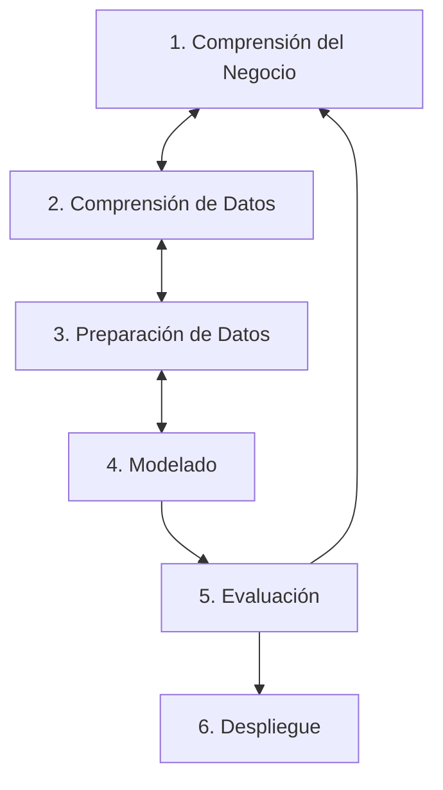

Mientras que los almacenes de datos y las vistas materializadas diagnostican el estado histórico (qué sucedió), la **Minería de Datos (Data Mining)** busca predecir fluctuaciones y comportamientos futuros utilizando algoritmos avanzados de aprendizaje automático (*Machine Learning*), estadística y matemáticas estocásticas.

---

### Paradigmas de Aprendizaje en Minería de Datos

Los algoritmos de minería de datos se clasifican fundamentalmente en dos grandes paradigmas de aprendizaje:

#### 1. Aprendizaje Supervisado
El algoritmo se entrena utilizando un conjunto de datos etiquetado (donde se conoce previamente la respuesta correcta o "variable objetivo").

* **Clasificación:** Se utiliza cuando la variable a predecir es categórica o discreta (ej. determinar si una transacción es "Fraude" o "Legítima").
  * *Árboles de Decisión:* Jerarquías de reglas condicionales basadas en entropía y ganancia de información.
  * *Máquinas de Vectores de Soporte (SVM):* Encuentran el hiperplano óptimo para separar las clases en espacios vectoriales multidimensionales.
  * *K-Nearest Neighbors (KNN):* Clasifica según la distancia geométrica (generalmente Distancia Euclidiana) a los $K$ registros más cercanos.
  * *Redes Neuronales:* Capas interconectadas de nodos (neuronas) con pesos que se ajustan mediante retropropagación (*backpropagation*) para resolver problemas no lineales de alta complejidad.
* **Regresión:** Se emplea cuando la variable objetivo es un valor numérico continuo (ej. predecir la facturación del próximo mes).

#### 2. Aprendizaje No Supervisado
El algoritmo opera sobre datos no etiquetados, buscando estructuras, agrupaciones o patrones inherentes sin intervención humana previa.

* **Agrupamiento (*Clustering*):** Segmenta registros similares basándose en métricas de proximidad. Es el núcleo de la micro-segmentación de clientes en mercadotecnia.
* **Reglas de Asociación:** Análisis de la canasta de compra que descubre relaciones de consumo simultáneo en transacciones. Evalúa axiomas de tipo:
  $$Si \Rightarrow Entonces \quad (A \Rightarrow B)$$
  * *Soporte:* Porcentaje de transacciones que contienen tanto a $A$ como a $B$.
  * *Confianza:* Probabilidad de que una transacción contenga a $B$ dado que contiene a $A$.
* **Detección de Anomalías:** Identifica datos atípicos (*outliers*) que difieren drásticamente del comportamiento promedio de la muestra. Se aplica en seguridad y detección de intrusos.

---

### Metodologías de Proyecto: KDD vs. CRISP-DM

Para que los proyectos de minería de datos sean exitosos, los equipos de ingeniería de datos deben regirse por metodologías estructuradas:

#### KDD (*Knowledge Discovery in Databases*)
Es una metodología lineal, académica e informática que consta de 5 fases secuenciales:
1. Selección de datos.
2. Preprocesamiento (limpieza y eliminación de ruido).
3. Transformación (normalización y reducción dimensional).
4. Minería de Datos (aplicación del algoritmo).
5. Evaluación y difusión del conocimiento.

#### CRISP-DM (*Cross-Industry Standard Process for Data Mining*)
Es el estándar de la industria más utilizado a nivel empresarial. A diferencia de KDD, CRISP-DM es un proceso cíclico e iterativo compuesto por 6 fases interactuantes:

| Fase CRISP-DM | Diferencia y Valor Agregado vs. KDD |
| :--- | :--- |
| **1. Comprensión del Negocio** | **No considerada en KDD.** Define las metas comerciales del proyecto y establece los criterios cuantitativos de ROI (Retorno de Inversión) del modelo. |
| **2. Comprensión de Datos** | Analiza la calidad y viabilidad de los datos de origen (análisis exploratorio) antes de iniciar cualquier preprocesamiento. |
| **3. Preparación de Datos** | Tarea iterativa que incluye limpieza, ingeniería de variables (*feature engineering*) y agregación (ETL analítico). |
| **4. Modelado** | Fase equivalente a la "Minería de Datos" de KDD; se prueban múltiples algoritmos paralelos y se calibran sus parámetros (*hyperparameter tuning*). |
| **5. Evaluación** | Compara la precisión técnica (ej. matrices de confusión, curvas ROC) contra los objetivos comerciales definidos en la Fase 1. Si el modelo no aporta valor real al negocio, se regresa a la primera fase. |
| **6. Despliegue** | Puesta en producción del modelo en la plataforma corporativa, implementando pipelines de monitoreo continuo contra el desgaste predictivo del modelo. |

---

## Ideas clave

<Callout type="info">
**KDD frente a CRISP-DM:**
KDD se enfoca en el rigor del flujo de datos en entornos científicos. CRISP-DM prioriza la alineación comercial, asegurando que cada fase del modelo analítico responda a necesidades y métricas financieras claras del negocio.
</Callout>
